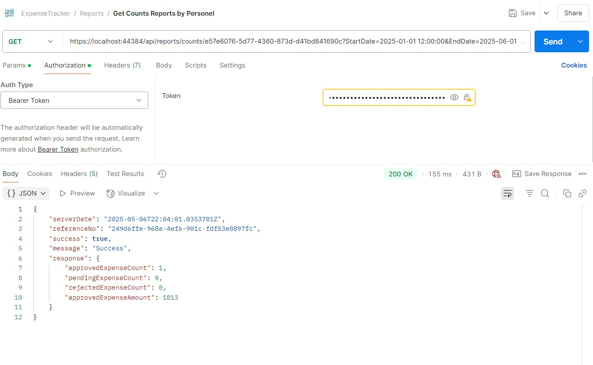
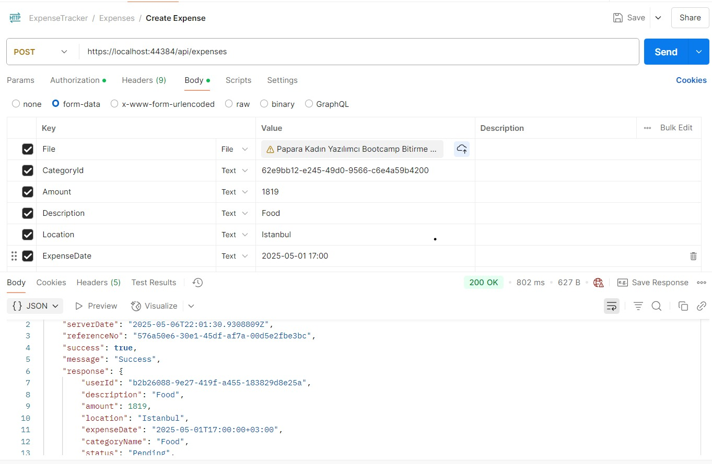
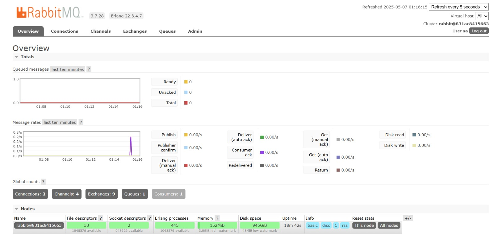
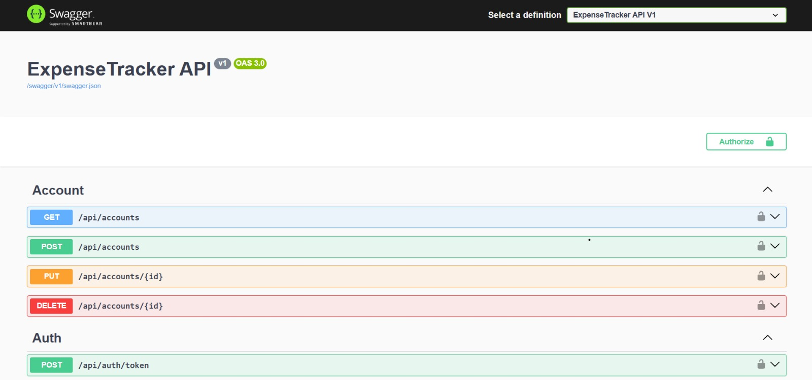
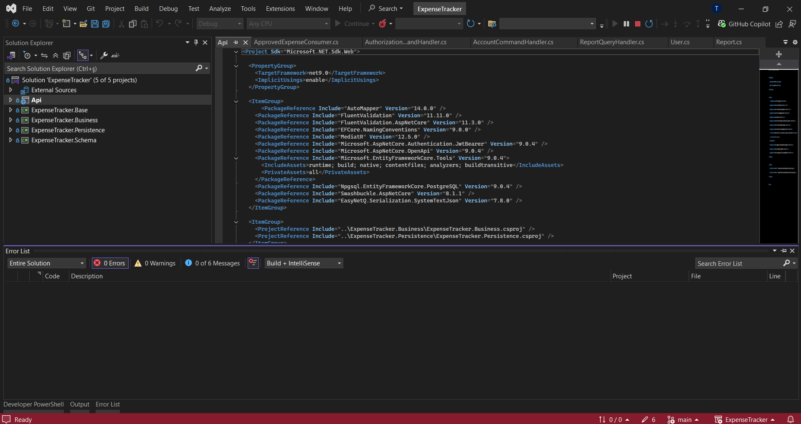

##  ExpenseTracker 

Saha çalışanlarının yaptığı masrafları kolayca sisteme girmesini ve yöneticilerin bu talepleri onaylayarak ödemeleri gerçekleştirmesini sağlayan bir masraf takip sistemi.
> Backend: .NET 9, PostgreSQL, CQRS, EF Core  
> JWT, Docker, FluentValidation, Swagger desteklidir.

----------

##  Özellikler

-   JWT destekli rol tabanlı kimlik doğrulama (Admin / Personel)
    
-    Personel, masraf talebi oluşturabilir ve durumunu takip edebilir
    
-   Admin, masraf taleplerini onaylayabilir / reddedebilir
    
-   Haftalık/aylık/günlük raporlama (Dapper + View/SP ile)
    
-   Ödeme simülasyonu (hayali EFT işlemi)
    
-   Docker Compose desteği ile hızlı kurulum
    
-    Validasyon kontrolleri (FluentValidation)
    

----------

##  Kullanılan Teknolojiler

-   .NET 9
    
-   PostgreSQL
    
-   Entity Framework Core (Code First)
    
-   CQRS + MediatR
    
-   Dapper
    
-   FluentValidation 
    
-   JWT Authentication
    
-   Swagger & Postman
    
-   Docker Compose
    
-   RabbitMQ 
    

----------

## Kurulum Talimatları

### 1. Repoyu klonlayın:

bash

KopyalaDüzenle

`git clone https://github.com/gonulsuturkekole/ExpenseTracker.git` 

### 2. Docker ile PostgreSQL + RabbitMQ başlatın:

bash

KopyalaDüzenle

`docker-compose up -d` 

### 3. Migration işlemleri:

bash

KopyalaDüzenle

`dotnet ef migrations add Initial \
  --verbose -p ./ExpenseTracker.Persistence \
  --msbuildprojectextensionspath ./ExpenseTracker.Persistence/obj \
  --context ExpenseTrackerDbContext -s ./Api/

dotnet ef database update \
  --verbose -p ./ExpenseTracker.Persistence \
  --context ExpenseTrackerDbContext -s ./Api/` 

### 4. API'yi başlatın:

bash

KopyalaDüzenle

`cd Api
dotnet run` 

Swagger arayüzü için:  
https://localhost:44384/Swagger/](http://localhost:44384/swagger)

----------

##  Rol Tabanlı Yetkiler

Rol /Yetkiler

Personel:

Masraf oluşturma, durum görüntüleme, red nedenini görme

Admin:

Masraf onaylama/red etme, açıklama yazma, ödeme başlatma, kategori/fixed veri yönetimi

----------

##  Raporlama Özellikleri

-   Kişiye özel işlem geçmişi
    
-   Günlük/Haftalık/Aylık harcama raporları
    
-   Onaylanan / reddedilen masraf özetleri
    
-   View / Stored Procedure ile verimli veri çekimi (Dapper)

##  Kullanım Senaryosu 
Personel → Masraf Oluştur → Admin Onaylar → RabbitMQ mesajı → Ödeme işlenir → Rapor oluşur


##  Projemde Yer Alan Bazı Kullanımlar Görselleri Ve Kodları

### Masraf Oluşturma – `POST /api/expenses`


##  Validasyon (FluentValidation)

### Kullanıcı Oluşturma İçin FluentValidation Kuralları

```csharp
public UserRequestValidator()
{
    RuleFor(x => x.UserName).NotEmpty().MinimumLength(3).MaximumLength(32);
    RuleFor(x => x.Role).IsInEnum();
    RuleFor(x => x.FirstName).NotEmpty().MinimumLength(2).MaximumLength(50);
    RuleFor(x => x.LastName).NotEmpty().MinimumLength(2).MaximumLength(50);
    RuleFor(x => x.Password).NotEmpty().MinimumLength(6).MaximumLength(24);

    RuleFor(x => x.Account).NotNull().WithMessage("At least one account is required.");
    RuleFor(x => x.Account).ChildRules(x =>
    {
        x.RuleFor(a => a.Name).NotEmpty().MinimumLength(2).MaximumLength(50);
        x.RuleFor(a => a.CurrencyCode).NotEmpty().MinimumLength(2).MaximumLength(3);
        x.RuleFor(a => a.AccountNumber).GreaterThan(0);
        x.RuleFor(a => a.IBAN)
            .NotEmpty()
            .MinimumLength(26)
            .MaximumLength(34)
            .Matches(@"^TR\d{2}\d{4}\d{4}\d{4}\d{4}\d{4}\d{2}$")
            .WithMessage("IBAN must be in the format TRxx xxxx xxxx xxxx xxxx xxxx xx");
    });
}
```csharp


###  Raporlama – Dapper ile Örnek Endpoint


public async Task<ApiResponse<ReportCountResponse>> Handle(ReportPersonelCountQuery request, CancellationToken cancellationToken)
{
    if (request.PersonelId == Guid.Empty)
        return new ApiResponse<ReportCountResponse>("UserId is required for this report.");

    var personel = await _unitOfWork.UserRepository.GetByIdAsync(request.PersonelId);
    if (personel == null)
        return new ApiResponse<ReportCountResponse>("Personel not found");
    else if (personel.Role == UserRoles.Admin)
        return new ApiResponse<ReportCountResponse>("This report only works with personels");

    var sql = @"
        SELECT
            COUNT(*) FILTER (WHERE status = 0) AS PendingExpenseCount,
            COUNT(*) FILTER (WHERE status = 1) AS ApprovedExpenseCount,
            COUNT(*) FILTER (WHERE status = 2) AS RejectedExpenseCount,
            COALESCE(SUM(amount) FILTER (WHERE status = 1), 0) AS ApprovedExpenseAmount
        FROM expenses
        WHERE expense_date BETWEEN @StartDate AND @EndDate
        AND user_id = @UserId
    ";

    var parameters = new DynamicParameters();
    parameters.Add("StartDate", request.Model.StartDate.UtcDateTime);
    parameters.Add("EndDate", request.Model.EndDate.UtcDateTime);
    parameters.Add("UserId", request.PersonelId);

    var result = await _unitOfWork.QuerySingleAsync<ReportCountResponse>(sql, parameters);
    return new ApiResponse<ReportCountResponse>(result);
}

 ##  API Belgeleri

- [Dökümantasyon (PDF)](assets/.docx/ExpenseTracker_API_Documentation%20(1).pdf)

##  Postman Örnek Get Endpoint Ekranı



##  Postman Örnek Post Endpoint Ekranı



##  RabbitMQ Çalışır Görüntüsü



##  Swagger Çalışır Arayüzü



## Visual Studio Geliştirme Ortamı Çalışır Görüntüsü




